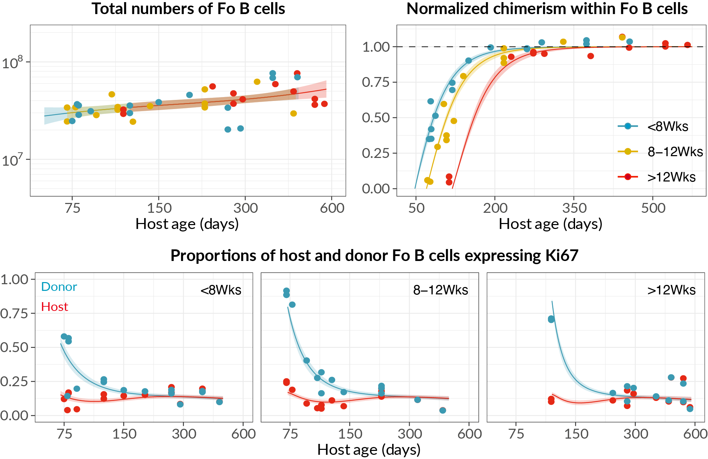

class:center

### Modeling fate-decisions and response-dynamics in the B cell lineage
<hr>

<br>

```{r echo=FALSE, fig.retina=3, out.width='100%'}

knitr::include_graphics("figures/Bcell_project.png")
```


---


## B cell maturation in the spleen
<hr>

- B cells transition through **short-lived** developmental stages in the spleen.


- Late-stage transitional (T2) B cells bifurcate into fully mature Follicular (Fo) or Marginal Zone (MZ) B cells.

<br>


```{r echo=FALSE, fig.retina=3, out.width='55%'}


```

---

## Division of labour and space
<hr>


Marginal Zone is an anatomical barrier that divides lymphocyte-rich follicles and the erythrocyte-rich red pulp.

.pull-left[
```{r echo=FALSE, fig.retina=3, out.width='100%'}


```

.citeR[*Zimber-Strobl Lab* <br>
Lechner _et al.,_ Nat Comm 2021 
]

]

.pull-right[


- **MZ B cells** are strategically positioned to identify and respond to **blood-borne** antigens.

  .BoldText[Gatekeepers of the immune system]
  
  
<br>

- **Fo B cells** typically respond to antigens presented by Dendritic cells and Macrophages in a T cell dependent manner and produce high-affinity antibodies.
  


]


???
5 % of circulation goes through spleen
blood cicrulation opens into marginal sinus where blood slows down so that Mphages and B cells guarding the sinus can filter it for antigens/pathogens.


---

### Division history of B cells
<hr>

- We used the **busulfan bone marrow** transplantation system to measure _total numbers_ and $f_d$ in Fo and MZ B cells.


- In addition, we measured Ki67 expression &rArr; extent of cell division in lymphocytes.


<br>

.pull-left[
- T and B cells continue expressing Ki67 protein for &sim; 4 days after the division.


> Residual expression from previous developmental stage? <br>
 <br>
> Division in the current stage?

.citeR[
Verheijn _et al._ Cell Reports 2020
]
]

.pull-right[
```{r echo=FALSE, fig.retina=3, out.width='80%'}

knitr::include_graphics("figures/div_hist.png")
```


]

---

class: center
### Neutral model explains MZ B cell dynamics
<hr>

.middle[
```{r echo=FALSE, fig.retina=3, out.width="85%"}

knitr::include_graphics("figures/MZ_fits2.png")
```
]


---

class: center

### Time (Host age) dependence in FO B cell dynamics
<hr>

.middle[
```{r echo=FALSE, fig.retina=3, out.width="85%"}


```
]


---
count:false

### Insights into naive B cell homeostasis
<hr>


#### Naive B cells divide **very rarely.**
  - Inter-division times Fo B cells &approx;  > 1 year (CI: 0.6-23)
  - Inter-division times MZ B cells &approx;  6 months (CI: 4-7)
  
  
--

#### Life-expectancy  of Fo B cells increases with mouse age.
  - Mean lifespan in a
    > 10 wk old mouse &approx;  35 days (CI: 2.5-4) </br>
    > 2 year old mouse &approx;  61 days


#### Mean residence time of MZ B cells &approx; 64 days (CI: 54-72) </br>
    


#### Constitutive replenishment
  - Approximately ** 3% of Fo and  1.2% of MZ B pool** is replaced daily by source influx.
  

.citeR[
Unpublished data and Verheijn _et. al._ Cell Reports 2020
]


---


class:center

### Immune-response dynamics of B lymphocytes

<hr>
<br>


```{r echo=FALSE, fig.retina=3, out.width='80%'}


```


---
count:false
class:center

### Immune-response dynamics of B lymphocytes

<hr>
<br>


```{r echo=FALSE, fig.retina=3, out.width='80%'}

knitr::include_graphics("figures/bcell_gc2.png")
```


De novo (Notch2-dependent) generation of MZ B cells during an immune response

.citebottom[
Babushku _et al._ Nature Communications 2024
]


???

### .BoldText[Does immune activation modulate B cell differentiation pathways?]


---

### Tracking antigen-specific B cells
<hr>


**C<sub>&gamma;1</sub>Cre reporter mice** immunized with NP-CGG antigen

- Responding B cells permanently express the reporter protein.

<br>

```{r echo=FALSE, fig.retina=3, out.width='80%'}


```

--


- Notch2 KO: Responding B cells express reporter and delete Notch2

- Notch2 is required for differentiation into MZ B phenotype <br>
&#8618; Notch2 KO data helps modeling

---

### Dynamical modelling of antigen-specific B cell response
<hr>


.pull-left[
```{r echo=FALSE, fig.retina=3, out.width='52%'}


```
]

.pull-right[
```{r echo=FALSE, fig.retina=3, out.width='55%'}


```
]

--
<br>

```{r echo=FALSE, fig.retina=3, out.width='100%'}


```


---


### What does this mean?

<hr>

#### Two likely (but not mutually exclusive)  theories: 

 - Antigen-specific MZ B cell clones (or at least a large fraction of them) are
 
  - Delegated to the marginal zone to improve protective coverage and prevent a concurrent systemic breach
  
--
  
  - Archived as memory-like clones for protection against future infections


--

<br>


#### A novel differentiation pathway or cell-state during B cell responses.
> Notch2 dependent: <br>
> Potential target for modulating the breadth and intensity of antibody responses.

`r icons::fontawesome("syringe")` &nbsp; Boosting vaccine efficacy or therapeutic interventions for autoimmune pathologies. 

???
We can leverage this information to design 

vaccine improvement? autoimmune?

---

### Questions to explore

<hr>

#### Notch2 guides the differentiation of activated B cells  to MZ fate:

> Is there any interaction between Notch2 and BCR?

> What role does BCR affinity play in MZ versus GC fate-determination?

--


<br>

#### To what extent is the MZ B cell generation at steady-states driven by (self) antigen activation?

> Malignant transformation from chronic or unwarranted activation

> Mouse models to study MZ B cell lymphomas


.right[
<h3 style="font-size:150%;">Apoorva Singh &nbsp;&nbsp; </h3>
]
.right-bottom-fixed[
```{r echo=FALSE, fig.retina=3, out.width='40%'}


```
]


???

Chronic or unwarranted activation linked with malignant transformation?


---


### Lineage tracing to pinpoint cell-states
<hr>


We are interested in understanding how distinct cell-states
 > Emerge during immune responses <br>
 > Evolve over time

--

<br>

.my-left-column[

- Functional diversification:
> Differentiation to Plasma, memory B cells, etc.

- Affinity maturation:
 > B cells undergo somatic hypermutation (SHM) and selection events 
 
 <br>
 
 .BoldText[
Both occur concurrently in the GC phase
]
]


.my-right-column[
<br>

```{r echo=FALSE, fig.retina=3, out.width='90%'}


```

]

--


#### .SimpleBold[`r icons::fontawesome("location-arrow")` &nbsp; Precursor-progeny relationships between B cell subsets based on SHM patterns]

---

### Single-cell BCR and RNA sequencing
<hr>


.citebottom[
In collaboration with **Schimdt-Supprian Lab**, TUM and **Zimber-Strobl Lab**, Helmholtz Munich
]

.pull-left[

```{r echo=FALSE, fig.retina=3, out.width='75%'}


```
]

.pull-right[
- Isolate antigen-specific B cells at three time points.
> B1-8<sup>lo</sup> BCR transgenics 

{{content}}

]


--

```{r echo=FALSE, fig.retina=3, out.width='75%'}


```


???

We will generate clone-trees and evaluate how often clones from the same branch end up in the same subset... for example.


<br>

Combining BCR and RNA expression dynamics 

- Identify gene signatures that coincide with excessive division or preferential selection <br>
 &#8618;
 Pinpoint cell-states that are most permissive to malignant transformation.


---


### Models representing continuous transition of cellular states
<hr>


`r icons::icon_style(icons::fontawesome("lightbulb", style = "solid"), scale = 1.5, fill = "#ECB442")` &nbsp; 
Dynamical model to map birth-death-selection events in individual clones

--

- Generate phylogeny-based simulations from the model

--

- Map the simulations on the observed data


- Infer parameters regulating clonal dynamics

--

<br>

`r icons::icon_style(icons::fontawesome("lightbulb", style = "solid"), scale = 1.5, fill = "#ECB442")` &nbsp; 
Identify gene signatures that coincide with excessive division or preferential selection <br>

> Pinpoint cell-states that are most permissive to malignant transformation


---

### <span style="color:#9c1c44">Mo</span>dular <span style="color:#9c1c44">S</span>tochastic and <span style="color:#9c1c44">A</span>daptive <span style="color:#9c1c44">I</span>terating <span style="color:#9c1c44">C</span>lusters

<hr>

The **Mosaic model** is a probabilistic mapping method to track population-structures <br> across data points


.pull-left[

<br>

```{r echo=FALSE, fig.retina=3, out.width='75%'}


```
]


.pull-right[

- Divide the state-space into **classes**


{{content}}

]

--

- Model evolves from the initial distribution stochastically


{{content}}

--

- Classes &mdash;

 - Pre-defined:  BCR clones, age-distribution, etc.

 - Learned from the data: Expression signature, Treated or Untreated groups, etc.


---
### Mosaic model operation
<hr>


Example: Mapping BCR clonal dynamics


```{r echo=FALSE, fig.retina=3, out.width='35%'}


```

--


```{r echo=FALSE, fig.retina=3, out.width='80%'}


```

---

### Prediction of the dynamics of activation-induced MZ B clones
<hr>

- Using parameter estimates derived from dynamical modeling of B cell response


- Initial conditions: Uniformly distributed 100 Mosaic classes (_i.e._ 100 clones)
 - Each with a single member

<br>

```{r echo=FALSE, fig.retina=3, out.width='80%'}


```

.citeR[
Colored curves denote dynamics of individual clones
]


---
class: center, middle

```{r echo=FALSE, fig.retina=3, out.width='100%'}


```

---
class: center, middle
count:false

```{r echo=FALSE, fig.retina=3, out.width='100%'}


```

.BoldText[
Clustering based on the dynamical properties
]


