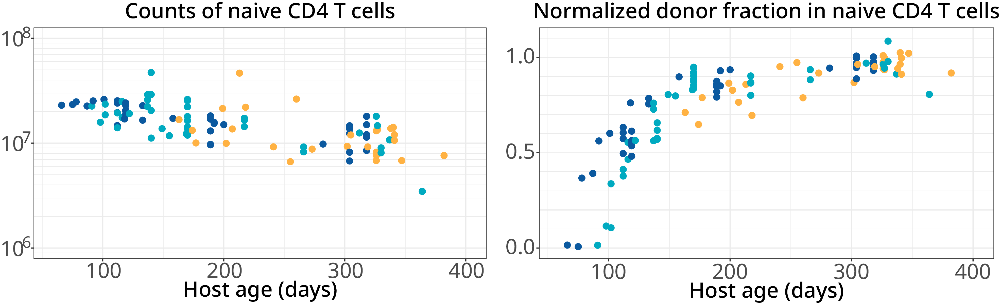

.center[
### Cell-fate mapping using bone marrow transplantation system
]

<hr>


```{r echo=FALSE, fig.retina=3, out.width='70%'}


```

<br>

Busulfan treatment:
> Eliminates hematopoietic stem cells (HSC) in bone marrow

> Leaves peripheral lymphoid compartments intact

.right[
#####  Seddon lab UCL
]


<!---
class: center

### Total numbers of T and B cell subsets
<hr>

```{r echo=FALSE, fig.retina=3, out.width='55%'}


```

<br>
**Stable chimerism with no/minimal effects on peripheral lymphocyte compartments**
--->

---
class: center, top

### Donor invasion kinetics
<hr>


.right-column[
```{r echo=FALSE, fig.retina=3, out.width='70%'}


```
]


.left-column[
<br>
CD4 T cell subset as an example
]

---

### The kinetics of donor-percolation are rich in information

<hr>


```{r echo=FALSE, fig.retina=3, out.width='100%'}

knitr::include_graphics("figures/Nfd_schema.png")
```

<br> 
.BoldText[Set point –]

- Whether replacement is complete or incomplete

> Heterogeneity within the compartment

--

.BoldText[Upslope –]

- How fast host cells are replaced by donor-BM-derived cells

> Interplay between influx and turnover

---

### Connecting biology to theory

<hr>

<br>

```{r echo=FALSE, fig.retina=3, out.width='80%'}


```


---

class: center
### Data from Busulfan chimeras

<hr>

Different colors denote groups of animals with different ages at BMT

<br>

```{r echo=FALSE, fig.retina=3, out.width='75%'}


```

--


```{r echo=FALSE, fig.retina=3, out.width='75%'}


```

---
## Model validation using Bayesian approach
<hr>


> At each time point $i$ (>= 1 animal/s), 

> $j$ quantities such as total numbers and $f_d$

<br>

$$
\begin{aligned}
&y_{ij} \sim \text{Normal}(\mu_{ij}, \Sigma) \quad \quad \quad \quad \quad \quad  &[\text{Likelihood}] \\
&\mu_i = M_j(\text{time}_i, \theta)  &[\text{Model prediction}]\\
\end{aligned}
$$
.center[
$\theta:$ Vector of model parameters and 
$\Sigma:$ Covariance matrix
]


<br>

.SimpleBold[Output:]
> Posterior distribution of model parameters $P(\theta | y)$  


> Estimate of confidence in the model &rArr; **Model weight** 

???
We define the likelihood of data y given the model.

which is the probability density of data across the parameter distribution by assuming that the errors are normally distributed. 

Normalized product of probability densities of both datasets and the prior distribution of params.

- This probability density is then used to update our prior beliefs in model parameters using the bayesian approach.


Parameters are sampled from the joint **prior** density using **Hamiltonian Monte Carlo** algorithm.

???
We measure this  out of sample prediction error using Leave-One-Out cross validation, in which a single observation is treated as test dataset and rest of the observations are trated as training data. The process is repeated for all 'n' observations and the prediction error for each left-out test set is aggregated to calculate Leave-One-Out information criterion (LOOIC).

???
We then used the estimated LOO-IC values to assess the relative support for models using the analog of the Akaike weight which gives us the probability that a given model will explain new data better than other models considered in this analysis.
---
class: center
### Life-expectancy of naive T cells increases with cell-age

<hr>

The adaptation model received strongest statistical support: .BoldText[&gt; 80% Model weight]

<br>

```{r echo=FALSE, fig.retina=3, out.width='75%'}


```


```{r echo=FALSE, fig.retina=3, out.width='75%'}


```


---

### Mechanistic meta analysis
<hr>


.citebottom[
Rane _et al._ eLife 2021, Mold _et al._ Plos Biology 2019, Rane _et al._ Plos Biology 2018
]


```{r echo=FALSE, fig.retina=3, out.width='90%'}


```

<br>
Across multiple data sets derived from diverse experiments:

- The adaptation model provides the most parsimonious explanation of naive T cell maintenance.

--

.shadedbox2[
Can waning T cell mediated immunity in the elderly be explained by the accumulation of old and functionally impaired T cells?  
]

---
    
<!---

.my-left-column[
```{r echo=FALSE, fig.retina=3, out.width='80%'}


```
]


.my-right-column[

```{r echo=FALSE, fig.retina=3, out.width='80%'}


```
]

--->

