####  Through the looking-glass as a chess game by Glen Downey


```{r echo=FALSE, fig.retina=3, out.width='25%'}

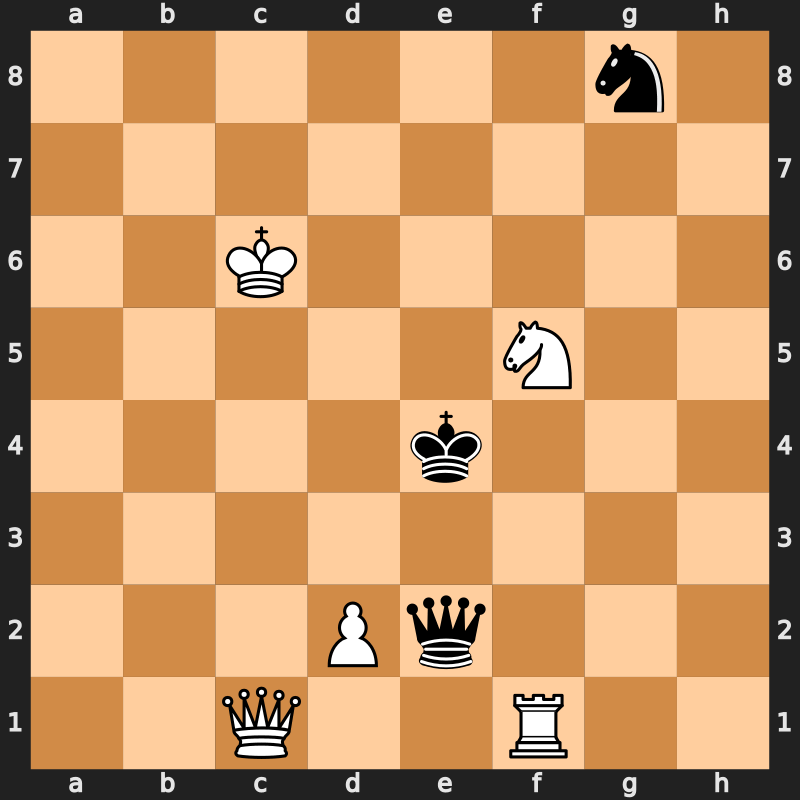
```

???

- Chess symbolism in alice through the looking glass

- admire chess complexity, well documented by the shanno no.


--

### Chess complexity

- **The Shannon number**: Estimates $10^{120}$ possible games

> Distinct rules of movement for each piece along the 8 $\times$ 8 board <br>
> A diverse set of permissible interactions 


- The state-space complexity of $10^{46}$

.citeR[
Chinchilkar, ICGA 1996,
Allis, University of Limburg 1994]

???
of a game is the number of legal game positions reachable from the initial position of the game


---

### Complexity and dynamism in the immune system

<hr>


 
#### Multiple subsets with unique properties and complex interactions

 - Naive T and B cells on activation
> Transform into **Effector** cells to curb the infection.  </br>
> Differentiate into **Memory** cells  and protect against re-exposure.
  

 
--


 </br>
 
#### Diverse repertoire of clones that identify **antigens** through specific receptors:
  > T cells express T cell receptor (TCR): Diversity > $10^{15}$ </br>
  > B cells express antibody molecules (Ig): Diversity > $10^{14}$
  
.citeR[
Mora and Walzack, ArXiv `r icons::academicons$arxiv` 2016,   Yaari & Kleinstein, Genome Med 2015, <br> Davis and Bjorkman, Nature 1988
]

---
class: inverse, center

<br>

<br>
<br>

## The state-space of immune responses is <br> astronomically large

???

- Inside an immune response the possible number of combinations that can arise starting from same initial conditions is pretty large

- most dont start from same init conds


--


<br>
<br>
<br>

## Understand the rules governing the <br> variability in our responses to diseases


???

But we conjecture --

Similar to how a simple set of rules on the chess board can result in an enormous number of possible game positions,

Something similar operates for our immune system
And if such a system of rules exist the we hope to explore and understand them


---

.center[
### Immune variability
]
<hr>

.SimpleBold[
Why do our immune systems produce distinct outcomes in similar disease contexts?
]

???

Immune variability is not a new concept. 
Immunologists have long pondered why our immune systems produce distinct outcomes in similar disease scenarios.


--

<br>


```{r echo=FALSE, fig.retina=3, out.width='90%'}

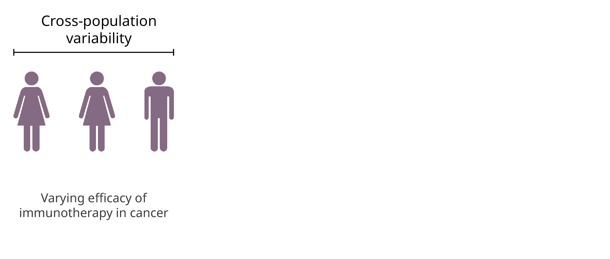
```

???
For instance, some cancer patients respond readily to immuno-therapy/checkpoint inhibitor blockade while others don't. 
There is variation within and among populations.


---
count:false

.center[
### Immune variability
]
<hr>

.SimpleBold[
Why do our immune systems produce distinct outcomes in similar disease contexts?
]


<br>


```{r echo=FALSE, fig.retina=3, out.width='90%'}

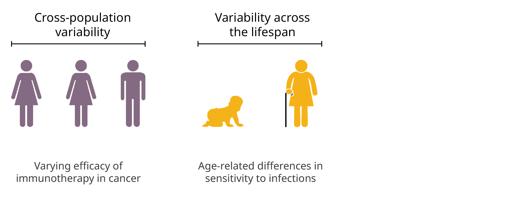
```

???
For example, some infections more prevalent in infants and the elderly than in healthy adults?
There is variation in immune competency across the lifespan within an individual

---
count:false

.center[
### Immune variability
]
<hr>

.SimpleBold[
Why do our immune systems produce distinct outcomes in similar disease contexts?
]
<br>


```{r echo=FALSE, fig.retina=3, out.width='90%'}

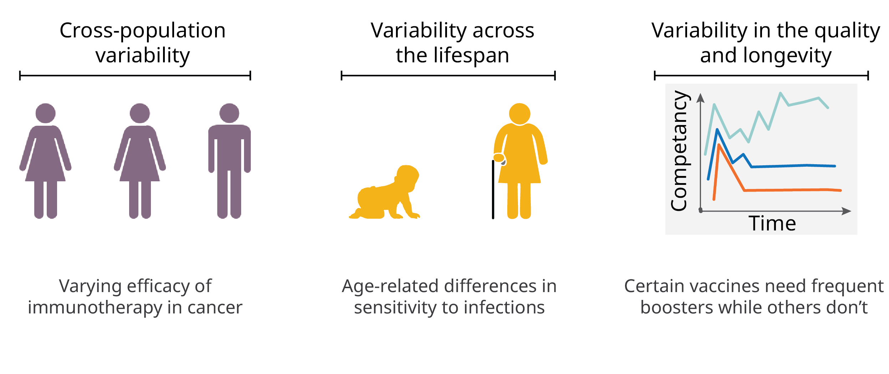
```


???
Lastly, for a given **type** of  context the quality of immune response, its strength and how long does the immune protection last varies substantially.
For example, certain vaccines provide lifelong protection, while others require frequent boosters?


.BoldText[Understanding determinants of immune variability remains a fundamental challenge.]


---

### Understanding lymphocyte heterogeneity

<hr>

.citebottom[Doctoral work]

<br>

Dissecting heterogeneity in unimodaly-distributed populations

<br>

.pull-left[

```{r echo=FALSE, fig.retina=3, out.width='100%'}

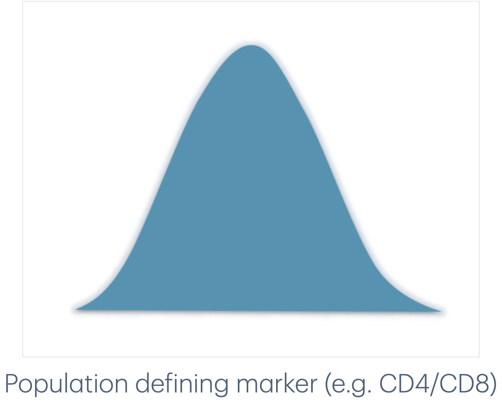
```
]

.pull-right[
<br>
<br>

Does the variability in expression of 'population-defining-markers' have any meaning? 
]
<br>

???

We began with a simple question 

When cell populations are selected using a population defining marker -- that is uniquely expressed on them, such as CD4 for CD4 T cells -- does the variability in that proxy marker have any meaning at all? 

---
count:false

### Lymphocyte heterogeneity

<hr>

<br>

Dissecting heterogeneity in unimodaly-distributed populations

<br>

.citebottom[Doctoral work]

.pull-left[

```{r echo=FALSE, fig.retina=3, out.width='100%'}

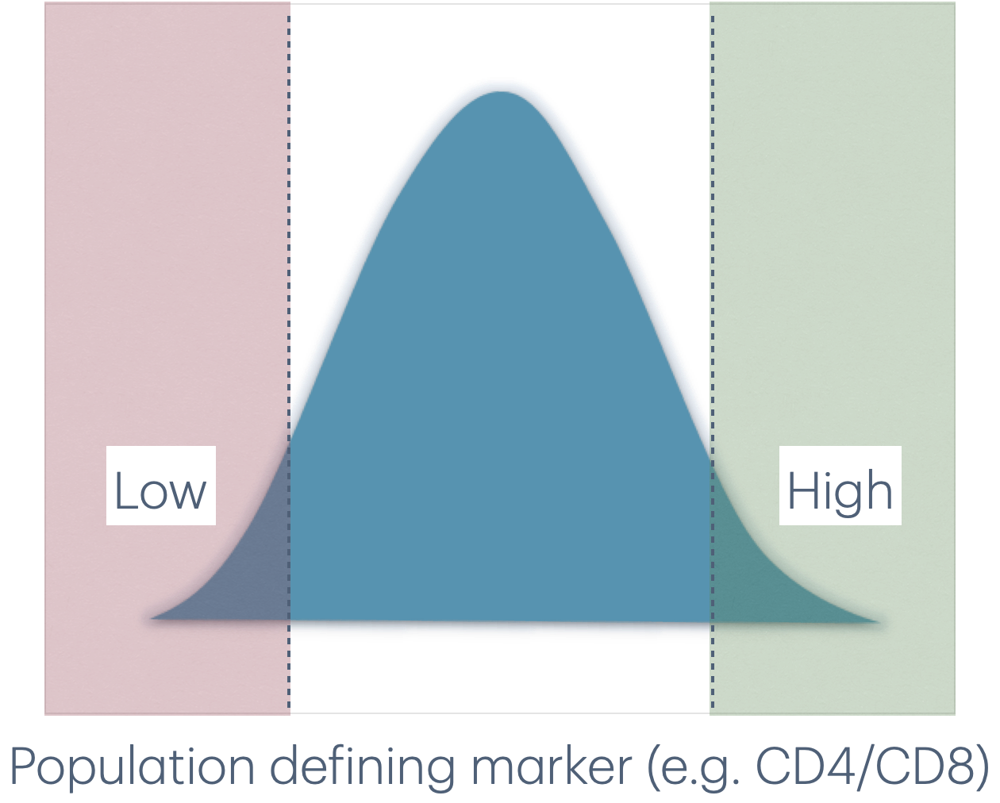
```
]

.pull-right[
<br>
<br>
.SimpleBold[
Is there any difference between the <br>
<span style="color:#638E64;">High</span>  and <span style="color:#E37383;">Low</span> cells?
]
]

???

Do cells that lie on each ends of the spectrum differ from each other? Or is it all random and they are all stochastically partitioned and keep moving across the distribution?


---

### Heterogeneity in T cells
<hr>

Co-receptor (CD4 and CD8) <span style="color:#E37383;">Low</span> naive T cells:


  - Respond poorly to stimulation &mdash;
    - Weaker activation and proliferation than co-receptor <span style="color:#638E64;">High</span> cells.
    
    
???
to answer this, I sorted the high and low expressing naive T cells for a bunch of protein markers e.g. CD4, CD8, PD1, TCR, etc. 
We indeed found that for several of these markers the variability in expression meant variability in phenotypic and functional properties of naive T cells. 


--

  - Show a distinct phenotype as compared to co-receptor <span style="color:#638E64;">High</span> cells &mdash;
    - Low expression of activation signaling proteins but &uArr; senescent markers
    - **Resemble T cells from old individuals**
    
    
--

<br>

.my-left-column[

```{r echo=FALSE, fig.retina=3, out.width='30%'}

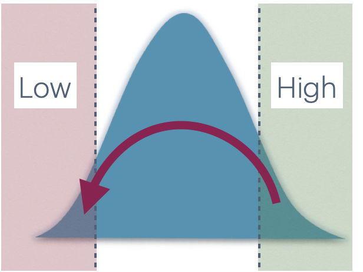
```
]

.my-right-column[
Co-receptor <span style="color:#638E64;">High</span> &rArr;  <br> Co-receptor <span style="color:#E37383;">Low</span> over time <br> **Cellular aging**
]

???
This was back when I was an experimental immunologist and was focusing on naive T cells

To answer this -- I sorted the high and low naive T cells for a bunch of protein markers e.g. CD4, CD8, PD1, TCR, etc. 

For Several of these markers the variability in expression meant variability in phenotype and functional properties of naive T cells. 

Strongest effects  for CD4 and CD8 co-receptors 
- co-receptor low cells showed poor responsiveness as compared to high cells and they also had a distinct phenotype. 
expressed high amounts of senescent markers and essentially resembled T cells from old individuals.


--


<h3 style="font-size:180%;">
.BoldText[Heterogeneity in T cell responsiveness is linked to the time spent in circulation]
</h3>

.citeR[
Balyan _et al._ Immunology 2019,
Rane _et al._ BMC Bio 2014
]

???

Over time, majority of co-receptor low cells persisted as low while, high cells lost their CD4/CD8 expression and became low cells, representing the cellular aging process.

We concluded that the Heterogeneity T cell responsiveness is basically linked to the time that they spend in circulation.


---

### Nature versus nurture
<hr>

.center[
.shadedbox2[As cells age &rarr; acquire the 'Low' expression signature &rarr; functionally-impaired]
]

<br>

- Poor T cell responses in old animals can in part be explained by <br>
&#8618;
Enrichment of functionally-impaired cells.

<br>

???

As I was finishing phd I had 2 hypotheses for the selective enrichment of "old" co-receptor Low cells
--


.BoldText[Adaptation model] 

Accrual in T cells' (and their progeny's) fitness as a function of their cell-age
 
   > _e.g.,_ continuous tuning of the threshold for mitogenic stimuli 
   
--

<br>


.BoldText[Selection model] 

Inherent variation in T cells' ability to persist within the circulation
  
  > _e.g.,_ heritable differences in sensitivity to survival signals


???
Alternatively, heterogeneity in lymphocytes  manifest as a result of adaptive changes that cells accrue as they age;

---


### Quantifying lymphocyte ecology

<hr>


#### Multiple processes contribute to **establishment** and **maintenance**.  
</h3>

 - Division, death, influx from the precursor, onward differentiation, etc.

<br>

```{r echo=FALSE, fig.retina=3, out.width='55%'}

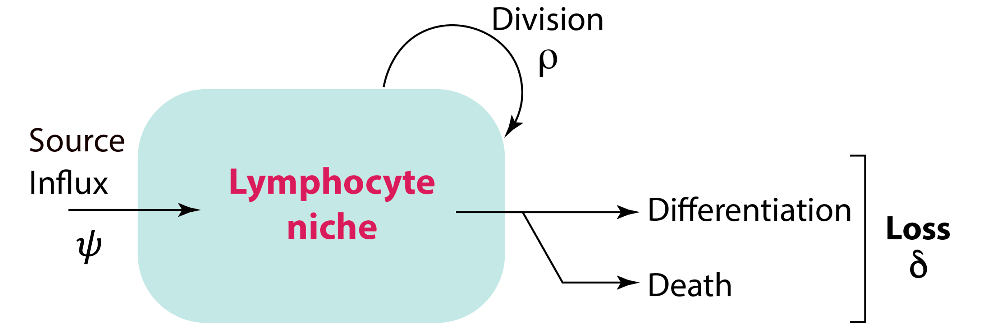
```

<br>


.MyBold[Homeostatic fitness] $\Phi = \rho - \delta$  
> The ability of a clone (a cell and its progeny) to persist in the population


<!---
class: center


### Ecology&dash;to&dash;response variation
<hr>
<hr>

<br>

<br>

T and B lymphocytes produce clones of varying sizes and disparate cell fates

<br>

<br>

<br>

```{r echo=FALSE, fig.retina=3, out.width='100%'}

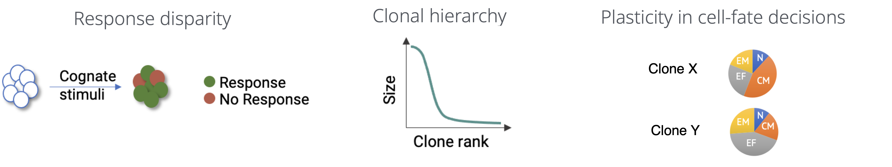
```


<br>

.citeR[
Bresser Nat Imm 2022, Mitchell PNAS 2021, Kibler JEM 2021, Balyan Immunology 2019, Zhou Front Imm 2018, Rane BMC Bio 2014, Gerlach Science 2013, Buccholz Science 2013, Spencer Nature 2009, Hawkins PNAS 2007, Haynes JEM 2005, Tangye Immunity 2004
]

.citebottom[continued...]

--->

---


### Ecology&dash;to&dash;response variation
<hr>

.center[
Variation in cellular states
of the initial responding population <br>
<span style="font-size:180%;"> &#8681; </span><br>
Response diversity 
]

???

The high-level idea is 

Variation in cellular-states such as 

- young or old cells 

- particular expression signature

- cells with varying division histories


Of course alternative or null hypothesis is  pure randomness. 

--

<br>
<br>


.blockquote[
<h3 style="color:black;"> `r 
icons::icon_style(icons::fontawesome("lightbulb", style = "solid"), scale = 1, fill = "#ECB442")` &nbsp; &nbsp; If we know the mechanisms that regulate lymphocyte populations
</h3>

 > ### .BoldText[Then we can conjecture the cell-state distribution of the initial responders]

]


---

### Mechanisms of lymphocyte maintenance

<hr>

How are lymphocyte populations regulated at steady-states?


.put-bottom-center[
```{r echo=FALSE, fig.retina=3, out.width='40%'}


```

Fitness: Net-effect of birth and death processes
]

.pull-left[

```{r echo=FALSE, fig.retina=3, out.width='100%'}

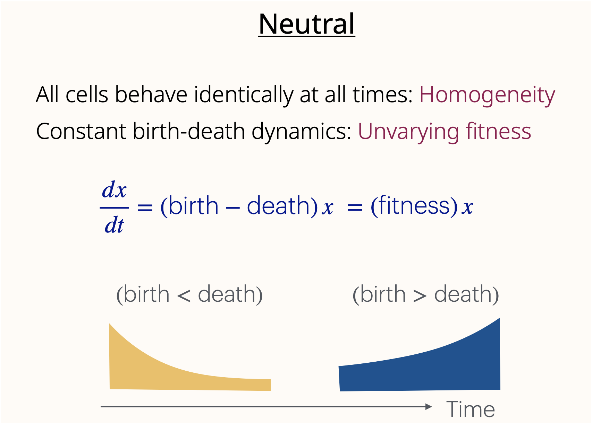
```
]

--

.pull-right[

```{r echo=FALSE, fig.retina=3, out.width='100%'}

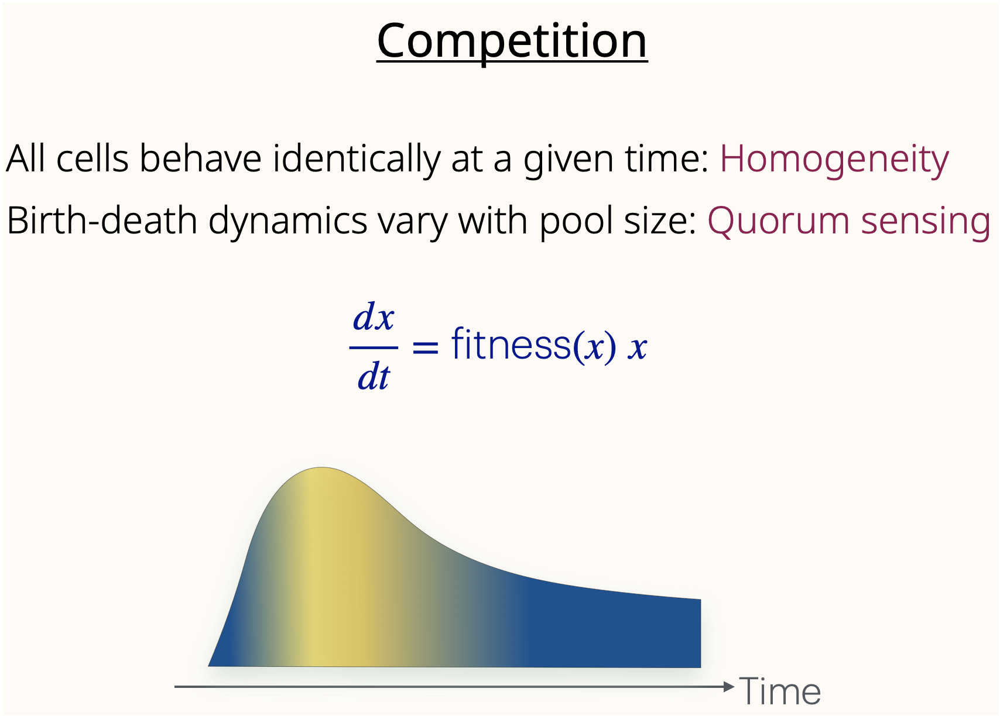
```
]


---

### Mechanisms of lymphocyte maintenance

<hr>


How are lymphocyte populations regulated at steady-states?


.put-bottom-center[
```{r echo=FALSE, fig.retina=3, out.width='40%'}


```

Fitness: Net-effect of birth and death processes
]

.pull-left[

```{r echo=FALSE, fig.retina=3, out.width='100%'}

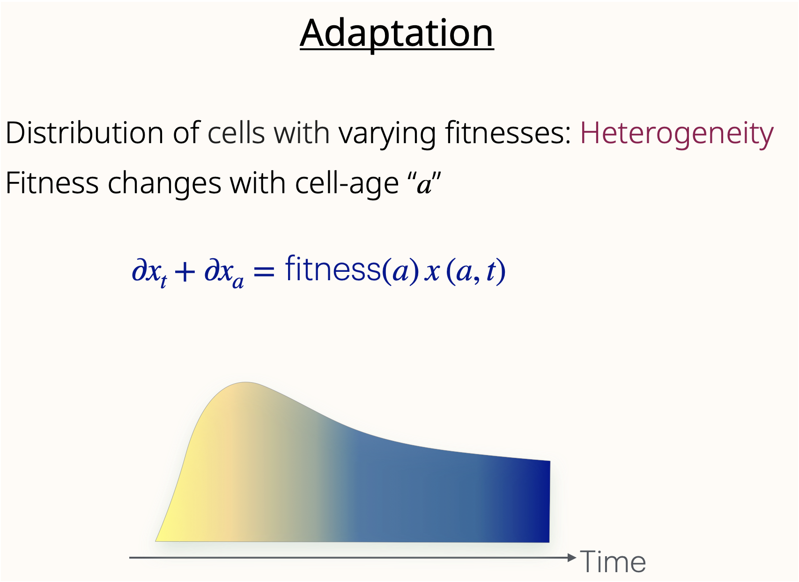
```
]

--

.pull-right[

```{r echo=FALSE, fig.retina=3, out.width='100%'}

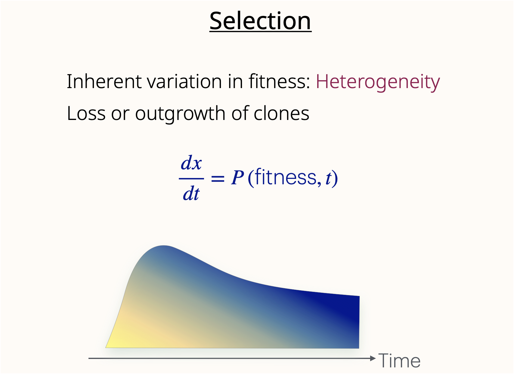
```
]


---
### Towards unifying models of lymphocyte homeostasis
<hr>


```{r echo=FALSE, fig.retina=3, out.width='95%'}

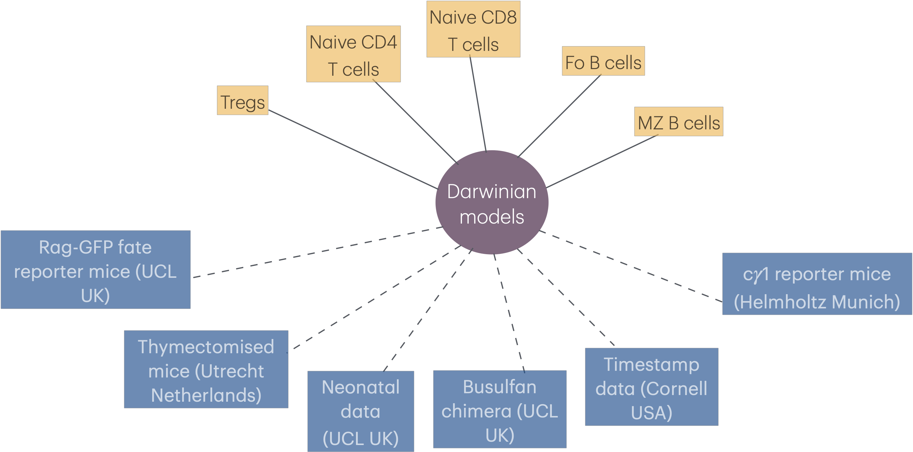
```


.citebottom[
Babushku _et al._ Nature Comm. 2024, Rane _et al._ eLife 2022; <br> 
Verheijn _et al._ Cell Reports 2020; Mold _et al._ PLoS Bio 2019; Rane _et al._ PLoS Bio 2018
]


