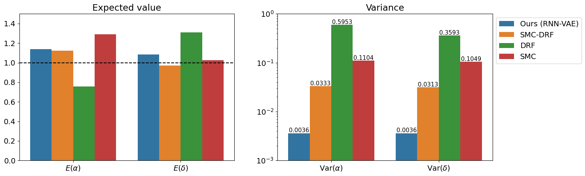

### Bayesian inverse problem
<hr>

What is an inverse problem?

> Given the observed data $x$ :

> Infer the **causal factors (model parameters $\theta$)** that generate the data

--

<br>


```{r echo=FALSE, fig.retina=3, out.width='65%'}


```
---

### Need for a new approach 
<hr>

- Curse of dimensionality: 
> Sampling from high-dimensional parameter space <br>  &#8658; **Computationally expensive**

--

- Intractable likelihood:
>  In case of multidimensional data (like ours) <br> &#8658; **Likelihoods are oftentimes ill-defined**


--

<br>

.BoldText[
Question of interest:
]
Is there a way to utilize the modern deep learning architectures to process high-dimensional, sequential data for Bayesian inverse problems?

---

### Autoencoder 
<hr>

- Encoder: Compress input into a latent-space of (smaller) dimension

- Decoder: Reconstruct input from the latent-space

<br>

```{r echo=FALSE, fig.retina=3, out.width='55%'}


```

.citeR[
Towards Data Science
]

--

<br>

.center[
Typical usage &mdash; Denoising, Recoloring, Watermark-removal, etc.
]


---

### Variational Auto-Encoder (VAE) 
<hr>

Autoencoders are deterministic and lack generative capabilities.

Key idea: Construct a distribution (in the latent space)

> The latent variables $z$ are drawn from a probability distribution depending on the input $x$

> The output $\tilde{x}$ is reconstructed probabilistically from $z$

<br>


```{r echo=FALSE, fig.retina=3, out.width='70%'}


```

.citeR[
Towards Data Science
]


---


### RNN-VAE 
<hr>

Key idea: Combine Recurrent Neural Network (RNN) with VAE 

- To process sequential data

    - Time-series or time-varying observations
    
    - Data points from multiple individuals

--

<br>


- To generate latent compact representation of the multidimensional data that
    
    - Preserves local information while reducing dimensionality 
    
    - Learns dependencies between successive data points
    
--
    
    - For a mathematical model representing the data:

      > Identifies the model parameters (_&theta;_)

---

### Proposed approach

<hr>

.BoldText[Goal]

> Infer causality: Estimate model parameters


<br>
<br>


```{r echo=FALSE, fig.retina=3, out.width='90%'}


```


<br>


---
count:false

### Proposed approach

<hr>

.BoldText[Goal]

> Infer causality: Estimate model parameters


<br>
<br>

```{r echo=FALSE, fig.retina=3, out.width='70%'}


```


.right[
<h3 style="font-size:150%;">Jun Won Park &nbsp;&nbsp; </h3>
]

.right-bottom-fixed[

```{r echo=FALSE, fig.retina=3, out.width='28%'}


```
]

---

### Lotka-Volterra predator-prey system
<hr>

<br>

.left-column[

<br><br><br>


$$
\frac{dx}{dt} = \alpha \, x - \beta \, x \, y 
$$
$$
\frac{dy}{dt} = \delta \, x \, y - \gamma \, y 
$$
]
.right-column[
```{r echo=FALSE, fig.retina=3, out.width='100%'}


```
]

---

### Lotka-Volterra predator-prey system
<hr>


```{r echo=FALSE, fig.retina=3, out.width='80%'}


```


---


### Results: Lotka-Volterra predator-prey system
<hr>

```{r echo=FALSE, fig.retina=3, out.width='80%'}


```


.citebottom[
We treated _&alpha;_ and _&delta;_ as free parameters; <br>
_&beta;_ and _&gamma;_ were fixed.
]

---

### Results: Lotka-Volterra predator-prey system

<hr>

```{r echo=FALSE, fig.retina=3, out.width='90%'}


```


---

### Benchmarking

<hr>

<br>

```{r echo=FALSE, fig.retina=3, out.width='100%'}


```


<br>

.citeR[
Best performance: $E(\cdot)$  closest to true values (1, 1) and lowest Variance <br>
Dinh _et al.,_ ArXiv `r icons::academicons$arxiv` 2024 <br> 
(Simon Tavaré Lab)
]

---

## Potential new directions
<hr>

- Can we analyze BCR- and RNA-seq data using RNN-VAE approach?

 > Learn observed dynamics then make predictions for future (or past) timecourses
 
 > Use dynamical models to guide
 
--

<br>

- Can we learn dynamics of one cell-state and then make predictions for another from its initial position?

 > Between samples (Test and Control groups)

 > From one infection to another


???
predicting cell states -- thats the whole point of VAE.
if we learn dynamics of one type can we predict of the other?
one infection to another?


---
count:false
class: center, middle

```{r echo=FALSE, fig.retina=3, out.width='100%'}

knitr::include_graphics("figures/Thanks_slide.png")
```


---
count:false

---
count:false

class: center, middle

We can identify B cell subsets during early stages of B cell response from published data.


```{r echo=FALSE, fig.retina=3, out.width='100%'}


```


---

count:false
class: center, middle
Finding MZ B signature


```{r echo=FALSE, fig.retina=3, out.width='100%'}


```


---
count:false

### Division history of B cells
<hr>

- We used the **busulfan bone marrow** transplantation system to measure _total numbers_ and $f_d$ in Fo and MZ B cells.


- In addition, we measured Ki67 expression &rArr; extent of cell division in lymphocytes.


<br>

.pull-left[
- T and B cells continue expressing Ki67 protein for &sim; 4 days after the division.


> Residual expression from previous developmental stage? <br>
 <br>
> Division in the current stage?

.citeR[
Verheijn _et al._ Cell Reports 2020
]
]

.pull-right[
```{r echo=FALSE, fig.retina=3, out.width='80%'}

knitr::include_graphics("figures/div_hist.png")
```


]

---
count:false

class: center
### Neutral model explains MZ B cell dynamics
<hr>

.middle[
```{r echo=FALSE, fig.retina=3, out.width="85%"}

knitr::include_graphics("figures/MZ_fits2.png")
```
]


---
count:false

class: center

### Time (Host age) dependence in FO B cell dynamics
<hr>

.middle[
```{r echo=FALSE, fig.retina=3, out.width="85%"}

knitr::include_graphics("figures/FM_results2.png")
```
]


---
count:false

### Insights into naive B cell homeostasis
<hr>


#### Naive B cells divide **very rarely.**
  - Inter-division times Fo B cells &approx;  > 1 year (CI: 0.6-23)
  - Inter-division times MZ B cells &approx;  6 months (CI: 4-7)
  
  
--

#### Life-expectancy  of Fo B cells increases with mouse age.
  - Mean lifespan in a
    > 10 wk old mouse &approx;  35 days (CI: 2.5-4) </br>
    > 2 year old mouse &approx;  61 days


#### Mean residence time of MZ B cells &approx; 64 days (CI: 54-72) </br>
    


#### Constitutive replenishment
  - Approximately ** 3% of Fo and  1.2% of MZ B pool** is replaced daily by source influx.
  

.citeR[
Unpublished data and Verheijn _et. al._ Cell Reports 2020
]

---
count:false

class: center, middle

### Fo B cell data from busulfan chimeras
<hr>

.middle[
```{r echo=FALSE, fig.retina=3, out.width="75%"}

knitr::include_graphics("figures/FM_data.png")
```
]


---
count:false
class: center, middle

### MZ B cell data from busulfan chimeras
<hr>

.middle[
```{r echo=FALSE, fig.retina=3, out.width="75%"}


```
]


